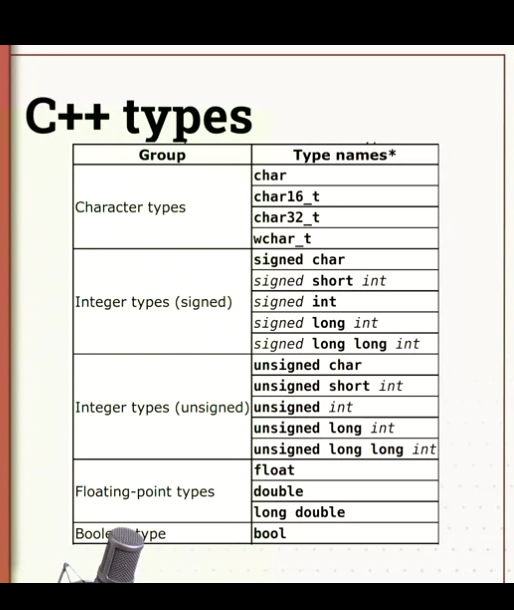

# 1.1 Coding workshop: looking at the data and modelling it

## C++ Programming: Classes and Data

- C++ is strongly typed
- C++ types quiz
- How are floating points represented
- quiz on floating point represnetations
- CSV order book data
- The order book data set
- The order book quiz
- Representing numberical order book data with variables
- Representing data with varaibles quiz
- Modelling the other data
- Modelling other data quiz
- Using an enum to represetn the bid/ask
- Enum to represent bid/ask quiz
- Representing mutliple order book entities: vector
- Multiple order book entries quiz
- Programming exercise: looking at the data and modelling it
- Share your findings
- How to back up your Visual Studio Code work

## C++ is strongly typed

In this video we're going to talk about types in C++, because we're going to start modeling some data now and we need to know how we can represent different types of numbers using the C++ language.

We're going to talk about data types

C++ provides stronger type checking than C

<!--  -->

So what it means that when you declare a varaible you have to state what type of data you're going to store in that varaible.

There are several types built into C++. You can see we'g

- C++ types quiz
- How are floating points represented
- quiz on floating point represnetations
- CSV order book data
- The order book data set
- The order book quiz
- Representing numberical order book data with variables
- Representing data with varaibles quiz
- Modelling the other data
- Modelling other data quiz
- Using an enum to represetn the bid/ask
- Enum to represent bid/ask quiz
- Representing mutliple order book entities: vector
- Multiple order book entries quiz
- Programming exercise: looking at the data and modelling it
- Share your findings
- How to back up your Visual Studio Code work
